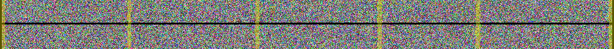

# FSH24
FSH24 - Fast Sample based Hash 24-byte.<br>
A super fast integrity hash using strategic 4MB sampling.

# The goal of FSH24
I aim to provide a system that allows for rapid checking and testing of large files from the internet.<br>
Games and videos have only ballooned in size over the past few years. Trying to process and verify these files with conventional hashing methods wastes way to much time and resources.<br>
We only really need to test if the file was downloaded correctly, we don't have to nit pick over every single byte in a file. We just need to know if it's "good enough".<br>
FSH24 aims to allow for robust file integrity checking, without taking 30 mins or more just to see if the game you downloaded is even going to install.

# Pros and Cons
<b>What FSH24 is good at</b>
- Basic integrity test for large files (100MB or more, ideally more then 5GB)
- Fast sampling as each "chunk" is only 4MB. and we only need a handful of samples to verify a file

<b>What FSH24 is NOT good at</b>
- 100% integrity. for eg, bit flipping or other weird edge cases wont be sampled and hashed.
- Malicious attacks. as this method is open source, it would be trivial to edit parts of the file and carve around the sampled sectors.

# How does FSH24 work
A conventional hashing algorithm will ingest the file hole, every last byte, like this<br>
</img>
This takes longer the larger the file is. FSH24 aims to take strategic samples of the file, like this<br>
</img>
FSH24 will scan / seek to pre defined sections of the file based on it's size, then we take a 4MB sample and Blake2b hash the sample, 
then we digest all the resulting hashes into one 24bit unique hash.<br>
The larger the file the more samples we take, we aim for at least 1% coverage of the hole file. Opposed  to 100% coverage from conventional hashing.<br>
However as we are only sampling on average 1% of the whole file for speed. the actual samples look more like this<br>
</img>
Even know we are sampling just a small amount of the total file, this is still enough to prove that any part of the file is corrupt.<br>
And if any single sampled sector is corrupt, as all the Blake2b hashes are digested together, any one bad sector will affect the final total hash value.<br>

FSH24 takes 4MB samples as this is the average size of most storage blocks (NTFS cluster alignment, SSD blocks, etc.)<br>
So the CPU of your computer only has to spend one cycle to go and fetch our sample for us. Instead of going back and forth a bunch of times
to build the samples we want to take.<br> This also means if you run a FSH24 check on a file two times in a row, the 2nd time will be dramatically faster<br>
(5 sec vs 0.2 sec) as the samples we are taking are so small and where just read by the drive or your os still has the samples cached for us, so we end up checking cache not the file.<br>
if this does happen, at least on windows, you can wait a min or so for the drive to un-cache and do windows things, then you can try to FSH24 hash again.<br>
It was proven with some benchmarking that samples smaller then this or samples that do not fit into powers of two actually take longer.<br>
as even if the file is smaller then a storage block, you have to make multiple passes to sample parts of the block.<br>
Please note though, with all this talk of storage blocks, we are not actually probing the file system to extract one block. we are just making a guess of where<br>
the block could be. This guess could be improved, but as we are running into cache speeds more then are we getting the right block, this level of optimization may be fruitless.<br>

FSH24 also has a "fast" or failsafe mode where, if the file size doesn't even match the expected file size listed in the hash
We can just skip the hashing and tell the user the file size is wrong. Normally just this alone is enough to test a bad download
but later we might add a command arg flag to bypass the skip on bad file size check.

# Hash brakedown
Below is a sample of a fsh24 file.
```sample.fsh24
FSH24-1
4614FB52E03E2B62C99A4F2425E6E7FE85B9C31E77025358|4|104864215|test\100MB.7z
BEC6265C89F55A0B008EDC6AE3D11C9C07C3B51D38D8D427|4|104857600|test\100MB.bin
0C117628765CF784A99D11E5984C58AD5636640FBF2C78B3|26|10737418240|test\10GB.bin
FE775931F727BB4D8446EC285145147FDD88F6928FA08DB7|4|1073741824|test\1GB.bin
```
At the very top of the file we have a `FSH24-1` "magic number".<br>
This indicates that this file is a Fast Sample based Hash 24-byte version 1.<br>
So later if we improve the algorithm or change something else we can easily identify a `FSH24-1` vs a `FSH24-2` file for eg. and offer backwards compatibility to the older hash file.<br>
Next each hash value is on a new line, and is broken into 4 parts separated by `|`<br>
The first part is our 24 bit (48 characters) hash.<br>
The next part is how many samples where taken to genrate the hash, as you can see the smaller 100 MB and 10 MB files only took 4 samples, where the larger 10GB file took 26 samples.<br>
The next part is our expected file size in bytes. This is so if the file has changed size in any way say for eg. the file download ended unexpectedly. We can skip doing the hash as the file is already very broken just based on file size.<br>
Last part is our file path to the file we want to hash check. This can be a relative file path like the above example, or like `..\oneFolderUp` or absolute file paths like `C:\folder\file.ext`<br>

